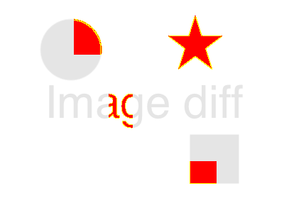

# Image diff api implementation using serverless framework

This is image diff api implementation using serverless framework.

|file1|file2|diff|
|---|---|---|
||||


### Prerequisites

You need to install serverless framework.
https://serverless.com/framework/docs/providers/aws/guide/installation/


### Deployment

```
sls deploy
```

### Example

You must include **"Accept: image/png"** header.

```
curl -X POST \
  url-to-deployed-api \
  -H 'Accept: image/png' \
  -H 'Accept-Encoding: gzip, deflate' \
  -H 'Cache-Control: no-cache' \
  -H 'Connection: keep-alive' \
  -H 'Content-Length: 77911' \
  -H 'Content-Type: multipart/form-data; boundary=--------------------------330836106272019966579877' \
  -H 'Host: 39l3kulmee.execute-api.us-east-1.amazonaws.com' \
  -H 'Postman-Token: 0d76da47-5fae-455b-bb51-5dd2f95893a8,9b835370-a153-443b-a524-3b2d38987599' \
  -H 'User-Agent: PostmanRuntime/7.20.1' \
  -H 'cache-control: no-cache' \
  -H 'content-type: multipart/form-data; boundary=----WebKitFormBoundary7MA4YWxkTrZu0gW' \
  -F file1=@/path/to/file1.png \
  -F file2=@/path/to/file1.png
  ```

## Built With

* [serverless framework](https://serverless.com/)

